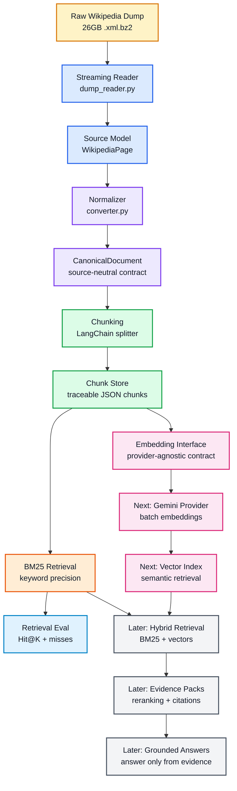

# Enterprise RAG Pipeline for 10M+ Documents


I am building this as a practical enterprise-style RAG pipeline, one layer at a time.

This is not a small "chat with PDF" demo. The goal is to build the foundation for a system that can eventually handle millions of documents, keep every transformation traceable, and reduce hallucination by improving evidence quality before generation starts.

My rule for this project:

> The LLM should only answer from evidence the pipeline can retrieve, rank, evaluate, and trace.

## Why This Exists

Most RAG failures do not start inside the model.

They start earlier:

```text
messy ingestion -> weak chunks -> poor retrieval -> bad context -> confident wrong answer
```

So I am building the pipeline from the ground up:

```text
raw source -> canonical document -> traceable chunks -> retrieval -> evaluation -> embeddings -> hybrid search
```

No shortcut. No hidden magic.

## Current Progress

### Step 1: Ingest and Normalize

Completed v1 with the Wikipedia dump.

```text
Wikipedia XML BZ2 dump
  -> streaming XML reader
  -> WikipediaPage
  -> CanonicalDocument
  -> data/canonical/wikipedia/*.json
  -> data/manifests/wikipedia_manifest.jsonl
```

### Step 2: Chunking

Completed with LangChain text splitters while keeping my own document contracts.

```text
CanonicalDocument
  -> LangChain Document
  -> RecursiveCharacterTextSplitter
  -> traceable chunk records
  -> data/chunks/wikipedia/*.json
  -> data/manifests/chunk_manifest.jsonl
```

### Step 3: BM25 Retrieval

Completed first-pass lexical retrieval over saved chunks.

BM25 matters because embeddings alone can miss exact identifiers, error codes, names, clause numbers, and rare terms.

### Step 4: Retrieval Evaluation

Completed a Hit@K evaluation layer and CLI.

```text
retrieval_eval.jsonl
  -> run retriever
  -> compare expected document/chunk
  -> calculate Hit@K
  -> print misses for debugging
```

### Step 5.1: Embedding Provider Interface

Completed the embedding abstraction layer.

The pipeline should not hardcode Gemini, OpenAI, or any specific provider into the core retrieval code. Instead, it now has a provider interface:

```text
EmbeddingRequest -> EmbeddingProvider -> EmbeddingResult
```

This makes the system easier to test, swap, observe, and scale.

## Colored Workflow



## Project Structure

```text
enterprise-rag-pipeline/
  src/
    enterprise_rag/
      documents.py
      document_store.py
      langchain_adapters.py
      chunker.py
      chunk_store.py
      chunk_documents.py
      search_chunks.py
      evaluate_retrieval.py
      embeddings/
        models.py
        providers.py
      evaluation/
        dataset.py
        models.py
        retrieval_eval.py
      retrieval/
        bm25.py
        models.py
        tokenizer.py
      wikipedia/
        dump_reader.py
        converter.py
        ingest.py
  tests/
  data/
    raw/
    canonical/
    chunks/
    evals/
    manifests/
```

The `data/` directory is intentionally ignored by Git because the local Wikipedia dump and generated artifacts are large.

## Core Ideas

### CanonicalDocument

Every source should eventually become one internal document shape:

```text
document_id
source
source_id
title
version
updated_at
text
metadata
```

Wikipedia, PDFs, emails, support tickets, and API exports should all become canonical documents before chunking or retrieval.

### Traceable Chunks

Every chunk keeps lineage back to the original document:

```text
chunk_id
document_id
source
source_id
title
chunk_index
text
metadata
```

This matters because retrieval without traceability is hard to debug and hard to trust.

### Retrieval Evaluation

Retrieval is measured before generation.

The current metric is Hit@K:

```text
Did the expected document or chunk appear in the top K results?
```

This is the first quality gate before adding vector search and generation.

### Embedding Provider Interface

The embedding layer is provider-agnostic.

```text
Gemini provider
OpenAI provider
local provider
```

All should satisfy the same interface, so the rest of the RAG pipeline does not care which embedding model is being used.

## Setup

```powershell
python -m venv .venv
.\.venv\Scripts\Activate.ps1
python -m pip install -e ".[dev]"
```

If activation is blocked:

```powershell
.\.venv\Scripts\python.exe -m pytest
```

## Run Checks

```powershell
.\.venv\Scripts\python.exe -m pytest
.\.venv\Scripts\python.exe -m ruff check .
```

## Ingest Wikipedia Pages

```powershell
.\.venv\Scripts\python.exe src\enterprise_rag\wikipedia\ingest.py data\raw\wikipedia\enwiki-latest-pages-articles-multistream.xml.bz2 --limit 10
```

Output:

```text
data/canonical/wikipedia/*.json
data/manifests/wikipedia_manifest.jsonl
```

## Chunk Canonical Documents

```powershell
.\.venv\Scripts\python.exe src\enterprise_rag\chunk_documents.py data\canonical\wikipedia --limit 3
```

Output:

```text
data/chunks/wikipedia/*.json
data/manifests/chunk_manifest.jsonl
```

## Search Chunks with BM25

```powershell
.\.venv\Scripts\python.exe -m enterprise_rag.search_chunks data\chunks\wikipedia "python programming language" --top-k 5
```

## Evaluate Retrieval

```powershell
.\.venv\Scripts\python.exe -m enterprise_rag.evaluate_retrieval data\chunks\wikipedia data\evals\retrieval_eval.jsonl --top-k 5 --show-misses
```

Expected eval JSONL shape:

```jsonl
{"query":"Python programming language","expected_document_id":"wikipedia:23862"}
{"query":"Artificial intelligence","expected_document_id":"wikipedia:1164"}
```

## Roadmap

### Done

- Stream huge Wikipedia dump safely
- Convert raw pages into canonical documents
- Save canonical documents as JSON
- Write ingestion manifest
- Add LangChain document adapter
- Split canonical documents into traceable chunks
- Save chunk JSON and chunk manifest
- Add BM25 keyword retrieval
- Add retrieval evaluation with Hit@K
- Add retrieval evaluation CLI
- Add embedding provider interface

### Next

- Implement Gemini embedding provider
- Batch embed chunk records
- Persist vectors with metadata
- Add vector search
- Combine BM25 + vector retrieval
- Add reranking
- Add evidence packs and citations

## My Current Mental Model

RAG is not:

```text
LLM + vector database
```

RAG is:

```text
clean documents + traceable chunks + measurable retrieval + provider-agnostic embeddings + grounded generation
```

One-line takeaway:

> The answer quality is limited by the evidence pipeline long before the LLM starts writing.
