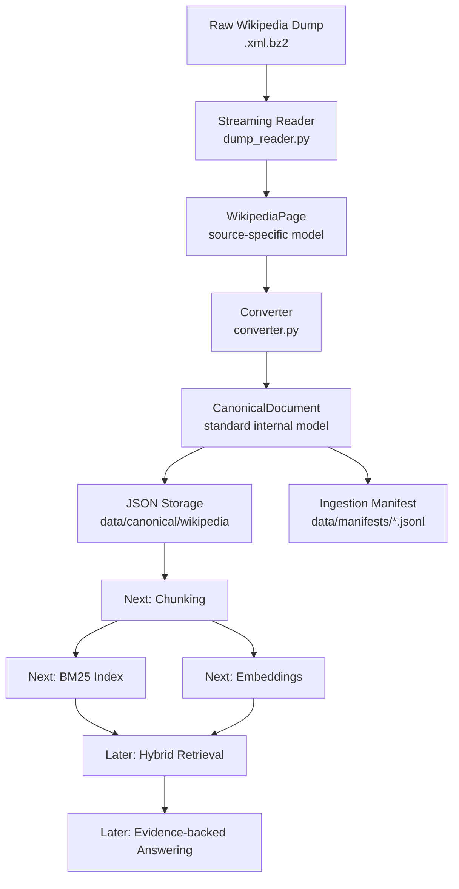

# Enterprise RAG Pipeline for 10M+ Documents


I am building this project as a practical, enterprise-style RAG pipeline.

The goal is not to make a small demo that sends a few chunks to an LLM. The goal is to design the kind of pipeline that can eventually handle **millions of documents**, keep the data flow explainable, and prepare clean evidence for retrieval.

Right now I am focused on the most important foundation:

> Ingest raw documents safely, normalize them into a standard format, and make every later step work from that clean format.

## Why I Am Building This

Most RAG examples skip the hard part.

They start with:

```text
documents → embeddings → vector database → LLM
```

But at real scale, the first problem is not the model.

The first problem is data preparation:

- Can I read huge files without loading them into memory?
- Can I convert messy source data into one clean internal format?
- Can I track where each document came from?
- Can I save reproducible canonical documents?
- Can I audit what was ingested?

This repo is my step-by-step implementation of that pipeline.

## Current Progress

### Completed: Step 1 v1 - Wikipedia Ingestion

Current source:

```text
data/raw/wikipedia/enwiki-latest-pages-articles-multistream.xml.bz2
```

That raw file is intentionally **not committed** to GitHub because it is huge.

Current working flow:

```text
Wikipedia XML BZ2 dump
  ↓
stream safely with iterparse
  ↓
WikipediaPage
  ↓
CanonicalDocument
  ↓
JSON files in data/canonical/wikipedia
  ↓
manifest records in data/manifests
```

## Pipeline Workflow



## Project Structure

```text
enterprise-rag-pipeline/
  src/
    enterprise_rag/
      documents.py
      wikipedia/
        dump_reader.py
        converter.py
        ingest.py
  tests/
    test_documents.py
    test_project_setup.py
    test_wikipedia_converter.py
    test_wikipedia_dump_reader.py
  data/
    raw/
    canonical/
    manifests/
  pyproject.toml
  README.md
```

## Core Concepts

### 1. WikipediaPage

`WikipediaPage` is the source-specific model.

It represents one page extracted from the Wikipedia dump.

```text
title
page_id
revision_id
timestamp
text
```

### 2. CanonicalDocument

`CanonicalDocument` is the internal format for the whole RAG system.

Later, PDFs, emails, CSV files, tickets, and API exports should all become this same structure.

```text
document_id
source
source_id
title
version
updated_at
text
metadata
```

This separation matters because the rest of the pipeline should not care whether the original source was Wikipedia, a PDF, or an internal document.

## Setup

Create and activate the virtual environment:

```powershell
python -m venv .venv
.\.venv\Scripts\Activate.ps1
```

Install the project:

```powershell
python -m pip install -e ".[dev]"
```

If PowerShell blocks activation, run commands directly through the virtual environment:

```powershell
.\.venv\Scripts\python.exe -m pytest
```

## Run Tests

```powershell
.\.venv\Scripts\python.exe -m pytest
.\.venv\Scripts\python.exe -m ruff check .
```

Current expected result:

```text
4 passed
All checks passed
```

## Preview The Wikipedia Dump

This reads a few pages from the compressed dump without extracting the full file:

```powershell
.\.venv\Scripts\python.exe src\enterprise_rag\wikipedia\dump_reader.py data\raw\wikipedia\enwiki-latest-pages-articles-multistream.xml.bz2 --limit 3
```

## Ingest Wikipedia Pages

Run a small ingestion first:

```powershell
.\.venv\Scripts\python.exe src\enterprise_rag\wikipedia\ingest.py data\raw\wikipedia\enwiki-latest-pages-articles-multistream.xml.bz2 --limit 10
```

Output:

```text
data/canonical/wikipedia/*.json
data/manifests/wikipedia_manifest.jsonl
```

Important:

```text
data/ is ignored by Git.
The downloaded Wikipedia dump and generated canonical JSON files should not be committed.
```

## Roadmap

### Step 1 - Ingest and Normalize

Status: in progress, v1 working.

- Stream huge source files safely
- Extract source-specific records
- Convert to canonical documents
- Save canonical JSON
- Write ingestion manifest

### Step 2 - Chunking

Next target.

- Load canonical documents
- Split long documents into smaller chunks
- Preserve document lineage
- Store chunk metadata

### Step 3 - BM25 Index

- Build keyword search over chunks
- Support exact terms, IDs, names, and rare keywords

### Step 4 - Embeddings

- Add embedding generation
- Store vectors
- Prepare semantic search

### Step 5 - Hybrid Retrieval

- Combine BM25 and vector search
- Merge candidates
- Rank evidence more carefully

### Step 6 - Evidence-Backed Answering

- Use retrieved chunks as evidence
- Generate answers only from context
- Add citations and fallback behavior

## My Engineering Rule For This Project

I am building this slowly on purpose.

For a 10M+ document RAG system, shortcuts become expensive later. The foundation needs to be simple, testable, and clear before adding embeddings, vector databases, reranking, or LLM calls.

One-line takeaway:

> A reliable RAG system starts before retrieval. It starts with clean, traceable, canonical documents.
