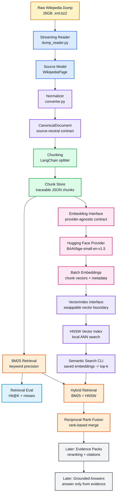

# Enterprise RAG Pipeline for 10M+ Documents


I am building this as a practical enterprise-style RAG pipeline, one layer at a time.

This is not a small "chat with PDF" demo. The goal is to build the foundation for a system that can eventually handle millions of documents, keep every transformation traceable, and reduce hallucination by improving evidence quality before generation starts.

My rule for this project:

> The LLM should only answer from evidence the pipeline can retrieve, rank, evaluate, and trace.

## Why This Exists

Most RAG failures do not start inside the model.

They start earlier:

```text
messy ingestion -> weak chunks -> poor retrieval -> bad context -> confident wrong answer
```

So I am building the pipeline from the ground up:

```text
raw source -> canonical document -> traceable chunks -> BM25 + HNSW retrieval -> evaluation
```

No shortcut. No hidden magic.

## Current Progress

### Step 1: Ingest and Normalize

Completed v1 with the Wikipedia dump.

```text
Wikipedia XML BZ2 dump
  -> streaming XML reader
  -> WikipediaPage
  -> CanonicalDocument
  -> data/canonical/wikipedia/*.json
  -> data/manifests/wikipedia_manifest.jsonl
```

### Step 2: Chunking

Completed with LangChain text splitters while keeping my own document contracts.

```text
CanonicalDocument
  -> LangChain Document
  -> RecursiveCharacterTextSplitter
  -> traceable chunk records
  -> data/chunks/wikipedia/*.json
  -> data/manifests/chunk_manifest.jsonl
```

### Step 3: BM25 Retrieval

Completed first-pass lexical retrieval over saved chunks.

BM25 matters because embeddings alone can miss exact identifiers, error codes, names, clause numbers, and rare terms.

### Step 4: Retrieval Evaluation

Completed a Hit@K evaluation layer and CLI.

```text
retrieval_eval.jsonl
  -> run retriever
  -> compare expected document/chunk
  -> calculate Hit@K
  -> print misses for debugging
```

### Step 5.1: Embedding Provider Interface

Completed the embedding abstraction layer.

The pipeline should not hardcode Hugging Face, Gemini, OpenAI, or any specific provider into the core retrieval code. Instead, it now has a provider interface:

```text
EmbeddingRequest -> EmbeddingProvider -> EmbeddingResult
```

This makes the system easier to test, swap, observe, and scale.

### Step 5.2: Hugging Face Embedding Provider

Completed the first open-source embedding provider.

The default model is:

```text
BAAI/bge-small-en-v1.5
```

This gives us a retrieval-focused local embedding path before adding vector search.

### Step 5.3: Batch Embed Chunk Records

Completed the first batch embedding script.

```text
data/chunks/wikipedia/*.json
  -> EmbeddingRequest batches
  -> HuggingFaceEmbeddingProvider
  -> EmbeddingResult
  -> data/embeddings/wikipedia/*.json
  -> data/manifests/embedding_manifest.jsonl
```

This step turns retrieval-ready chunks into vector-search-ready records while preserving chunk and document lineage.

### Step 6.1: Vector Index Interface

Completed the vector search boundary.

The RAG pipeline should not depend directly on one vector engine. It should depend on a small interface:

```text
VectorRecord -> VectorIndex -> VectorSearchResult
```

This lets me start with local HNSW and still keep a clean path to FAISS, Qdrant, Milvus, or Pinecone later.

### Step 6.2: HNSW Vector Index

Completed the first local ANN vector index implementation.

```text
saved embedding vectors
  -> VectorRecord
  -> HNSWVectorIndex
  -> semantic top-k results
```

HNSW gives the project a scalable semantic retrieval path without jumping straight into external vector database infrastructure.

### Step 6.3: Semantic Search over Saved Embeddings

Completed the loader and CLI for searching saved embedding JSON files.

```text
data/embeddings/wikipedia/*.json
  -> VectorRecord
  -> HNSWVectorIndex
  -> query embedding
  -> semantic top-k chunks
```

This proves that the project can move from persisted chunk vectors to actual semantic retrieval.

### Step 7: Hybrid Retrieval

Completed the first hybrid retrieval layer.

```text
user query
  -> BM25 keyword search
  -> Hugging Face query embedding
  -> HNSW semantic search
  -> Reciprocal Rank Fusion
  -> final ranked evidence chunks
```

BM25 catches exact terms like names, IDs, error codes, policy numbers, and rare phrases.

HNSW semantic search catches meaning when the user asks with different wording.

The results are fused with Reciprocal Rank Fusion instead of directly comparing BM25 scores with vector similarity scores. This keeps the ranking practical and avoids pretending that two different score systems mean the same thing.

This is the first real enterprise-style retrieval layer in the project.

## Colored Workflow



## Project Structure

```text
enterprise-rag-pipeline/
  src/
    enterprise_rag/
      documents.py
      document_store.py
      langchain_adapters.py
      chunker.py
      chunk_store.py
      chunk_documents.py
      embedding_store.py
      embed_chunks.py
      search_chunks.py
      search_vectors.py
      search_hybrid.py
      evaluate_retrieval.py
      embeddings/
        huggingface.py
        models.py
        providers.py
      evaluation/
        dataset.py
        models.py
        retrieval_eval.py
      retrieval/
        bm25.py
        hybrid.py
        models.py
        tokenizer.py
      vector_store/
        hnsw.py
        indexes.py
        loaders.py
        models.py
      wikipedia/
        dump_reader.py
        converter.py
        ingest.py
  tests/
  data/
    raw/
    canonical/
    chunks/
    embeddings/
    evals/
    manifests/
```

The `data/` directory is intentionally ignored by Git because the local Wikipedia dump and generated artifacts are large.

## Core Ideas

### CanonicalDocument

Every source should eventually become one internal document shape:

```text
document_id
source
source_id
title
version
updated_at
text
metadata
```

Wikipedia, PDFs, emails, support tickets, and API exports should all become canonical documents before chunking or retrieval.

### Traceable Chunks

Every chunk keeps lineage back to the original document:

```text
chunk_id
document_id
source
source_id
title
chunk_index
text
metadata
```

This matters because retrieval without traceability is hard to debug and hard to trust.

### Retrieval Evaluation

Retrieval is measured before generation.

The current metric is Hit@K:

```text
Did the expected document or chunk appear in the top K results?
```

This is the first quality gate before adding vector search and generation.

### Embedding Provider Interface

The embedding layer is provider-agnostic.

```text
Gemini provider
OpenAI provider
Hugging Face provider
local provider
```

All should satisfy the same interface, so the rest of the RAG pipeline does not care which embedding model is being used.

### Vector Index Interface

The vector search layer is also provider-agnostic.

```text
HNSW today
FAISS later
Qdrant/Milvus/Pinecone later
```

The retrieval pipeline should call:

```text
index.add(records)
index.search(query_vector, top_k)
```

not hardcode one vector database everywhere.

### HNSW Vector Index

HNSW is the first concrete vector index in this project.

It keeps a mapping between internal integer labels and my original vector records:

```text
hnsw label -> record_id -> chunk_id -> document_id -> metadata
```

That lineage matters because semantic search results eventually need citations, audits, and debugging.

### Hybrid Retrieval

The hybrid retriever combines BM25 and HNSW instead of choosing one.

```text
BM25 result rank      -> exact keyword confidence
Semantic result rank  -> meaning-based confidence
RRF fused rank        -> final evidence ordering
```

This matters because enterprise queries often mix both worlds:

```text
"What does policy HR-EXP-204 say about reimbursement deadline?"
```

The policy ID needs keyword precision. The reimbursement wording needs semantic matching.

Hybrid retrieval gives the pipeline a stronger evidence set before reranking and generation.

## Setup

```powershell
python -m venv .venv
.\.venv\Scripts\Activate.ps1
python -m pip install -e ".[dev]"
```

For local Hugging Face embeddings:

```powershell
python -m pip install -e ".[dev,huggingface]"
```

For local vector search with HNSW:

```powershell
python -m pip install -e ".[dev,huggingface,vector]"
```

If activation is blocked:

```powershell
.\.venv\Scripts\python.exe -m pytest
```

## Run Checks

```powershell
.\.venv\Scripts\python.exe -m pytest
.\.venv\Scripts\python.exe -m ruff check .
```

## Ingest Wikipedia Pages

```powershell
.\.venv\Scripts\python.exe src\enterprise_rag\wikipedia\ingest.py data\raw\wikipedia\enwiki-latest-pages-articles-multistream.xml.bz2 --limit 10
```

Output:

```text
data/canonical/wikipedia/*.json
data/manifests/wikipedia_manifest.jsonl
```

## Chunk Canonical Documents

```powershell
.\.venv\Scripts\python.exe src\enterprise_rag\chunk_documents.py data\canonical\wikipedia --limit 3
```

Output:

```text
data/chunks/wikipedia/*.json
data/manifests/chunk_manifest.jsonl
```

## Search Chunks with BM25

```powershell
.\.venv\Scripts\python.exe -m enterprise_rag.search_chunks data\chunks\wikipedia "python programming language" --top-k 5
```

## Evaluate Retrieval

```powershell
.\.venv\Scripts\python.exe -m enterprise_rag.evaluate_retrieval data\chunks\wikipedia data\evals\retrieval_eval.jsonl --top-k 5 --show-misses
```

Expected eval JSONL shape:

```jsonl
{"query":"Python programming language","expected_document_id":"wikipedia:23862"}
{"query":"Artificial intelligence","expected_document_id":"wikipedia:1164"}
```

## Embed Chunks

First create chunks:

```powershell
.\.venv\Scripts\python.exe -m enterprise_rag.chunk_documents data\canonical\wikipedia --limit 5
```

Then embed a small sample:

```powershell
.\.venv\Scripts\python.exe -m enterprise_rag.embed_chunks data\chunks\wikipedia --limit 5 --batch-size 2
```

Output:

```text
data/embeddings/wikipedia/*.json
data/manifests/embedding_manifest.jsonl
```

## Vector Index Layer

The vector layer is available as a clean Python interface:

```python
from enterprise_rag.vector_store import HNSWVectorIndex, VectorRecord

index = HNSWVectorIndex(dimensions=384, metric="cosine")
index.add([vector_record])
results = index.search(query_vector, top_k=5)
```

This is the base for semantic retrieval before hybrid search.

## Search Saved Embeddings with HNSW

```powershell
.\.venv\Scripts\python.exe -m enterprise_rag.search_vectors data\embeddings\wikipedia "anarchism political philosophy" --top-k 5 --limit 100
```

## Hybrid Search with BM25 + HNSW

```powershell
.\.venv\Scripts\python.exe -m enterprise_rag.search_hybrid data\chunks\wikipedia data\embeddings\wikipedia "anarchism political philosophy" --top-k 5 --limit 100
```

The output shows whether each result came from:

```text
bm25
semantic
bm25, semantic
```

That visibility is useful for debugging retrieval quality.

## Roadmap

### Done

- Stream huge Wikipedia dump safely
- Convert raw pages into canonical documents
- Save canonical documents as JSON
- Write ingestion manifest
- Add LangChain document adapter
- Split canonical documents into traceable chunks
- Save chunk JSON and chunk manifest
- Add BM25 keyword retrieval
- Add retrieval evaluation with Hit@K
- Add retrieval evaluation CLI
- Add embedding provider interface
- Add Hugging Face embedding provider
- Batch embed chunk records
- Persist vectors with metadata
- Add vector index interface
- Add HNSW vector index
- Load saved embedding JSON files into vector records
- Run semantic search over saved embeddings
- Combine BM25 + HNSW semantic search with hybrid retrieval
- Fuse retrieval results with Reciprocal Rank Fusion

### Next

- Add reranking
- Add evidence packs and citations
- Add retrieval confidence scoring
- Add generation guardrails

## My Current Mental Model

RAG is not:

```text
LLM + vector database
```

RAG is:

```text
clean documents + traceable chunks + measurable retrieval + provider-agnostic embeddings + swappable vector search + grounded generation
```

One-line takeaway:

> The answer quality is limited by the evidence pipeline long before the LLM starts writing.
