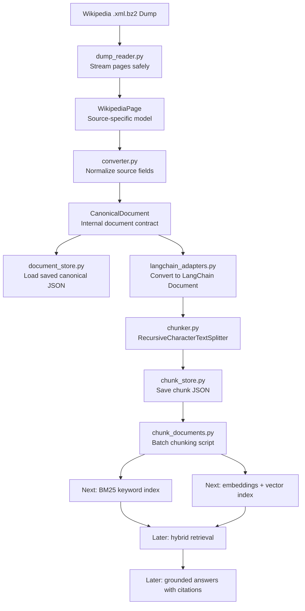

# Enterprise RAG Pipeline for 10M+ Documents


I am building this as a practical enterprise-style RAG pipeline, one layer at a time.

The goal is not to make a small "chat with PDF" demo. The goal is to build the kind of pipeline that can eventually handle millions of documents, keep every transformation traceable, and prepare clean evidence for retrieval.

My rule for this project:

> Do not let the LLM become responsible for fixing a weak data pipeline.

## Why This Exists

Most RAG failures start before generation.

Bad ingestion creates bad documents.
Bad documents create bad chunks.
Bad chunks create weak retrieval.
Weak retrieval creates confident wrong answers.

So I am building the foundation first:

```text
raw source -> canonical document -> LangChain document -> traceable chunks -> retrieval later
```

No shortcut. No hidden magic.

## Current Progress

### Step 1: Ingest and Normalize

Completed v1 with the Wikipedia dump.

The raw source is:

```text
data/raw/wikipedia/enwiki-latest-pages-articles-multistream.xml.bz2
```

That file is intentionally ignored by Git because it is huge.

Step 1 flow:

```text
Wikipedia XML BZ2 dump
  -> streaming XML reader
  -> WikipediaPage
  -> CanonicalDocument
  -> data/canonical/wikipedia/*.json
  -> data/manifests/wikipedia_manifest.jsonl
```

### Step 2: Chunking

Current Step 2 work:

```text
CanonicalDocument
  -> LangChain Document
  -> RecursiveCharacterTextSplitter
  -> chunk records
  -> data/chunks/wikipedia/*.json
  -> data/manifests/chunk_manifest.jsonl
```

This is where the pipeline starts becoming retrieval-ready.

## Workflow



## Project Structure

```text
enterprise-rag-pipeline/
  src/
    enterprise_rag/
      documents.py
      document_store.py
      langchain_adapters.py
      chunker.py
      chunk_store.py
      chunk_documents.py
      wikipedia/
        dump_reader.py
        converter.py
        ingest.py
  tests/
    test_documents.py
    test_langchain_adapters.py
    test_chunker.py
    test_chunk_documents.py
    test_wikipedia_converter.py
    test_wikipedia_dump_reader.py
  data/
    raw/
    canonical/
    chunks/
    manifests/
```

## Core Ideas

### CanonicalDocument

This is the internal document format.

Every source should eventually become this shape:

```text
document_id
source
source_id
title
version
updated_at
text
metadata
```

Wikipedia, PDFs, emails, support tickets, and API exports should all become canonical documents before chunking or retrieval.

### LangChain Document Adapter

I am using LangChain where it helps, but I am not letting it own the whole architecture.

The adapter keeps my metadata and lineage intact while allowing LangChain tooling to work on the content.

### Traceable Chunks

Every chunk keeps the original document identity:

```text
chunk_id
document_id
source
source_id
title
chunk_index
text
metadata
```

This matters because retrieval without traceability is hard to debug and hard to trust.

## Setup

```powershell
python -m venv .venv
.\.venv\Scripts\Activate.ps1
python -m pip install -e ".[dev]"
```

If activation is blocked:

```powershell
.\.venv\Scripts\python.exe -m pytest
```

## Run Checks

```powershell
.\.venv\Scripts\python.exe -m pytest
.\.venv\Scripts\python.exe -m ruff check .
```

## Ingest Wikipedia Pages

```powershell
.\.venv\Scripts\python.exe src\enterprise_rag\wikipedia\ingest.py data\raw\wikipedia\enwiki-latest-pages-articles-multistream.xml.bz2 --limit 10
```

Output:

```text
data/canonical/wikipedia/*.json
data/manifests/wikipedia_manifest.jsonl
```

## Chunk Canonical Documents

```powershell
.\.venv\Scripts\python.exe src\enterprise_rag\chunk_documents.py data\canonical\wikipedia --limit 3
```

Output:

```text
data/chunks/wikipedia/*.json
data/manifests/chunk_manifest.jsonl
```

## Roadmap

### Done

- Stream huge Wikipedia dump safely
- Convert raw pages into canonical documents
- Save canonical documents as JSON
- Write ingestion manifest
- Add LangChain document adapter
- Split canonical documents into traceable chunks
- Save chunk JSON and chunk manifest

### Next

- Build a BM25 keyword index over chunks
- Add exact-match retrieval for names, IDs, and rare terms
- Add Gemini embeddings later
- Add vector search
- Combine BM25 + vector retrieval
- Add evidence packs and citations

## My Current Mental Model

RAG is not:

```text
LLM + vector database
```

RAG is:

```text
clean documents + traceable chunks + strong retrieval + grounded generation
```

One-line takeaway:

> The answer quality is limited by the evidence pipeline long before the LLM starts writing.
