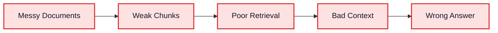
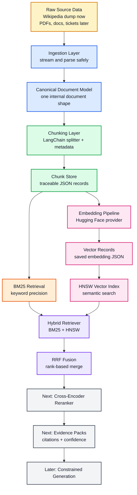
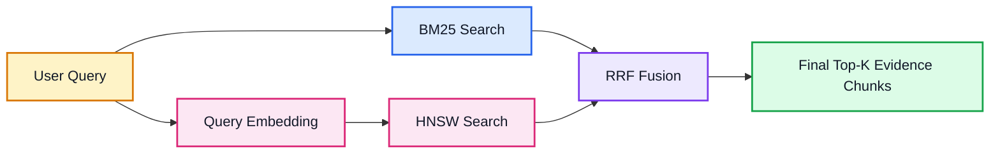
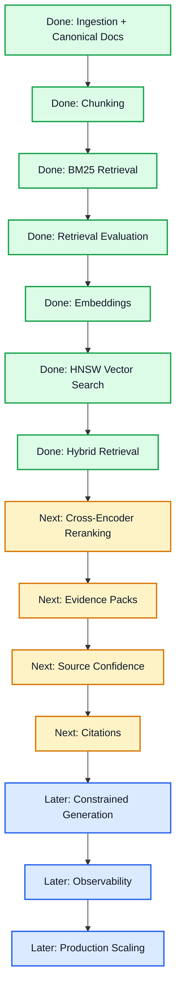

# Enterprise RAG Build Notes


I am building this project as a production-style RAG pipeline for large document collections.

The goal is not to make another small chatbot demo.

The goal is to understand and implement the real engineering layers behind a RAG system that could eventually work with millions of documents:

```text
ingestion -> normalization -> chunking -> retrieval -> embeddings -> vector search -> hybrid retrieval -> reranking -> evidence -> grounded answer
```

My main rule for this project is simple:

> The model should only answer from evidence the system can retrieve, rank, verify, and trace.

That is the mindset behind every step.

## Why I Am Building This

Most people talk about hallucination as if it is only an LLM problem.

I am treating it as a pipeline problem.

If the ingestion is messy, the chunks will be weak.

If the chunks are weak, retrieval will be unreliable.

If retrieval is unreliable, the LLM receives bad context.

And if the LLM receives bad context, it can produce a confident wrong answer.

So I am building the system from the bottom up instead of starting with generation.



The real work is not only asking a model to answer.

The real work is controlling what evidence reaches the model in the first place.

## Current High-Level Architecture

This is the current direction of the project.



## What I Have Built So Far

### Step 1: Ingestion and Normalization

I started with a huge Wikipedia XML BZ2 dump.

This matters because enterprise RAG usually starts with messy data:

- PDFs
- Word files
- spreadsheets
- scanned documents
- wiki pages
- tickets
- emails
- API exports

For the first version, I focused on reading Wikipedia safely without loading everything into memory.

The ingestion layer currently does this:

```text
Wikipedia .xml.bz2 dump
  -> streaming XML parser
  -> WikipediaPage
  -> CanonicalDocument
  -> JSON document store
  -> ingestion manifest
```

The important lesson here:

> Ingestion is not file upload. Ingestion is knowledge preparation.

If the system cannot preserve source identity, version, metadata, and lineage, the later retrieval layers become harder to trust.

### Step 2: Canonical Document Model

I created a source-neutral document contract.

Instead of letting every data source have its own shape, every source eventually becomes:

```text
document_id
source
source_id
title
version
updated_at
text
metadata
```

This is important because later steps should not care whether a document came from Wikipedia, a PDF, SharePoint, Jira, Slack, or an internal API.

Everything should enter the pipeline through one stable contract.

### Step 3: Chunking with Metadata

After documents are normalized, they need to be split into smaller pieces.

I used LangChain text splitters for chunking, but kept my own internal data model around it.

The chunk records preserve lineage:

```text
chunk_id
document_id
source
source_id
title
chunk_index
text
metadata
```

This matters because later, when a chunk is retrieved, I need to know exactly where it came from.

A RAG system without chunk lineage is difficult to debug and almost impossible to audit properly.

### Step 4: BM25 Retrieval

I added BM25 as the first retrieval layer.

BM25 is not new, but it is still extremely useful in enterprise search.

Embeddings are good for meaning.

BM25 is good for exact terms:

- product codes
- policy IDs
- legal clauses
- user names
- error messages
- API fields
- rare keywords

For example:

```text
"HR-EXP-204 reimbursement deadline"
```

A vector model may understand the general meaning, but BM25 is more likely to respect the exact policy code.

That is why I did not skip keyword retrieval.

### Step 5: Retrieval Evaluation

Before moving deeper into embeddings, I added evaluation.

The first evaluation metric is Hit@K:

```text
Did the expected document or chunk appear in the top K results?
```

This is basic, but it gives the pipeline an early quality gate.

My thinking:

> If retrieval cannot find the right evidence, generation cannot recover reliably.

So retrieval must be tested before the LLM is added.

### Step 6: Embedding Provider Interface

I added a provider interface for embeddings.

The goal is to avoid hardcoding one vendor or one model into the system.

The contract is:

```text
EmbeddingRequest -> EmbeddingProvider -> EmbeddingResult
```

This makes the system easier to test and easier to extend.

Today I can use Hugging Face.

Later I can add Gemini, OpenAI, local models, or any enterprise embedding provider without rewriting the retrieval pipeline.

### Step 7: Hugging Face Embeddings

I added the first open-source embedding provider using Hugging Face.

The current default model is:

```text
BAAI/bge-small-en-v1.5
```

I chose this because it is a practical retrieval-focused model and works well for local development.

The pipeline can now:

```text
chunk records
  -> embedding requests
  -> Hugging Face embedding provider
  -> embedding results
  -> saved vector JSON files
```

This turns plain text chunks into vector-search-ready records.

### Step 8: Vector Index Interface

I added a vector index boundary.

The system should not be tightly coupled to HNSW, FAISS, Qdrant, Milvus, or Pinecone.

The retrieval code should depend on this idea:

```text
VectorRecord -> VectorIndex -> VectorSearchResult
```

That gives me a clean path:

```text
HNSW now
FAISS later
Qdrant/Milvus/Pinecone later
```

This is an enterprise habit I want to keep in the project:

> Depend on stable contracts, not concrete infrastructure too early.

### Step 9: HNSW Semantic Search

I implemented local HNSW search using `hnswlib`.

HNSW gives approximate nearest neighbor search, which is important when the corpus grows.

The flow is:

```text
saved embedding JSON files
  -> VectorRecord loader
  -> HNSWVectorIndex
  -> query embedding
  -> semantic top-k results
```

This gives the project a semantic search path without needing an external vector database yet.

### Step 10: Hybrid Retrieval

The latest major step is hybrid retrieval.

I combined:

```text
BM25 keyword search
+ HNSW semantic search
+ Reciprocal Rank Fusion
```

The reason is simple:

BM25 and embeddings solve different problems.

BM25 is better for exact matching.

Embeddings are better for semantic meaning.

Hybrid retrieval gives better evidence because it can catch both.

The current hybrid flow:



I used Reciprocal Rank Fusion because BM25 scores and vector similarity scores are not directly comparable.

Instead of pretending the raw scores mean the same thing, RRF uses ranking position.

That is more practical for combining different retrievers.

## Current Project State

The project can currently do this:

```text
1. Read a large Wikipedia dump safely
2. Convert pages into canonical documents
3. Save normalized documents
4. Split documents into traceable chunks
5. Search chunks with BM25
6. Evaluate retrieval with Hit@K
7. Generate embeddings with Hugging Face
8. Save embedding records
9. Load vectors into HNSW
10. Run semantic search
11. Run hybrid BM25 + HNSW retrieval
```

Current quality checks:

```text
ruff check .
pytest
```

The repo has tests around the important contracts so the pipeline can grow without rewriting previous layers again and again.

## How I Think About Hallucination

I am not trying to claim absolute zero hallucination.

That would not be honest.

What I am building is a system where hallucination becomes harder to produce and easier to detect.

The direction is:

```text
better ingestion
  -> better chunks
  -> better retrieval
  -> better ranking
  -> stronger evidence
  -> constrained generation
  -> citation-backed answers
```

The LLM should not be the source of truth.

The retrieved evidence should be the source of truth.

The model should be the synthesis layer.

## What I Will Build Next

### Next Step: Cross-Encoder Reranking

Hybrid retrieval gives a strong candidate set, but it is still not the final evidence layer.

Next, I want to add a reranker.

The idea:

```text
hybrid top 50 or 100 candidates
  -> cross-encoder reranker
  -> better ordered top 5 or 10 evidence chunks
```

Why this matters:

BM25 and vectors are good first-pass retrievers.

A cross-encoder can compare the query and candidate chunk together more deeply.

This helps separate:

```text
related text
```

from:

```text
answer-supporting evidence
```

That difference is very important for reducing hallucination.

### Evidence Packs

After reranking, I want to create evidence packs.

An evidence pack should contain:

```text
query
selected chunks
source document IDs
retrieval scores
reranker scores
metadata
citations
confidence signals
```

The answer generator should receive evidence packs, not random chunks.

This makes the generation layer easier to control and audit.

### Source Confidence Scoring

Not all documents should have equal weight.

Eventually the system should score sources using signals like:

- freshness
- document type
- source system
- approval status
- version
- authority
- access permissions
- duplicate or near-duplicate status

Example:

```text
approved 2026 policy > old draft > random chat message
```

This is one of the biggest differences between toy RAG and enterprise RAG.

### Citation-Backed Answers

The final answer should not just sound correct.

It should show where each important claim came from.

The goal is:

```text
answer claim -> source chunk -> source document -> metadata
```

If the system says:

```text
Employees have 30 days to submit expenses.
```

It should also be able to point to the exact policy chunk that supports it.

### Constrained Generation

Once generation is added, the LLM should follow strict rules:

```text
answer only from provided evidence
do not use external knowledge
do not guess
cite important claims
say "insufficient evidence" when needed
```

This is how I want to keep the LLM grounded.

The model should not behave like a creative writer.

It should behave like a careful research assistant.

### Fallback Layer

Sometimes the correct answer is no answer.

If the evidence is weak, the system should refuse to answer instead of producing a polished guess.

This will require thresholds around:

- retrieval confidence
- reranker score
- source trust
- evidence agreement
- citation coverage

For high-stakes RAG, restraint is a feature.

### Observability

I also want the system to explain how it produced an answer.

The trace should include:

```text
original query
BM25 results
semantic results
hybrid fused results
reranker scores
selected evidence
generation prompt
citations
latency
token usage
final answer
```

If I cannot inspect why the system answered something, I should not trust it in production.

### More Evaluation

Hit@K is only the beginning.

I want to add:

- recall@K
- MRR
- nDCG
- reranker evaluation
- hallucination checks
- citation coverage
- answer faithfulness
- refusal correctness

The long-term goal is to evaluate the whole pipeline, not just the final answer.

## Enterprise Design Principles I Am Following

### 1. Stable Contracts First

I am trying to avoid hardcoding tools everywhere.

That is why the project has interfaces for:

- embedding providers
- vector indexes
- document models
- retrieval results

This lets the system evolve without rewriting everything.

### 2. Traceability Everywhere

Every object should keep lineage.

```text
chunk -> document -> source -> metadata
```

This is important for debugging, citations, and audits.

### 3. Retrieval Before Generation

I am intentionally building retrieval quality before adding answer generation.

A stronger LLM cannot reliably fix weak evidence.

Better retrieval usually improves RAG more than simply switching to a larger model.

### 4. Local First, Scalable Later

I am starting with local files, JSON, Hugging Face, and HNSW.

That keeps the system understandable while the architecture is forming.

Later, the same contracts can move toward:

- object storage
- distributed workers
- FAISS
- Qdrant
- Milvus
- Pinecone
- Postgres metadata storage
- monitoring dashboards

### 5. Test Each Layer

Every layer should be testable without needing the whole pipeline running.

That is why there are focused tests for:

- document conversion
- chunking
- BM25 retrieval
- retrieval evaluation
- embeddings
- vector search
- hybrid retrieval

## My Long-Term Roadmap



## What This Project Is Teaching Me

The biggest lesson so far:

> RAG quality is mostly evidence engineering.

The model matters, but the pipeline around the model matters just as much.

A production RAG system needs:

- clean ingestion
- normalized documents
- reliable chunking
- metadata preservation
- keyword retrieval
- semantic retrieval
- hybrid ranking
- evaluation
- reranking
- source confidence
- citations
- observability
- fallback behavior

This project is my way of building those layers properly, step by step.

## Current One-Line Summary

I am building an enterprise-style RAG pipeline where the LLM is not trusted blindly.

The system must first retrieve evidence, rank it, evaluate it, trace it, and only then use it to generate an answer.
